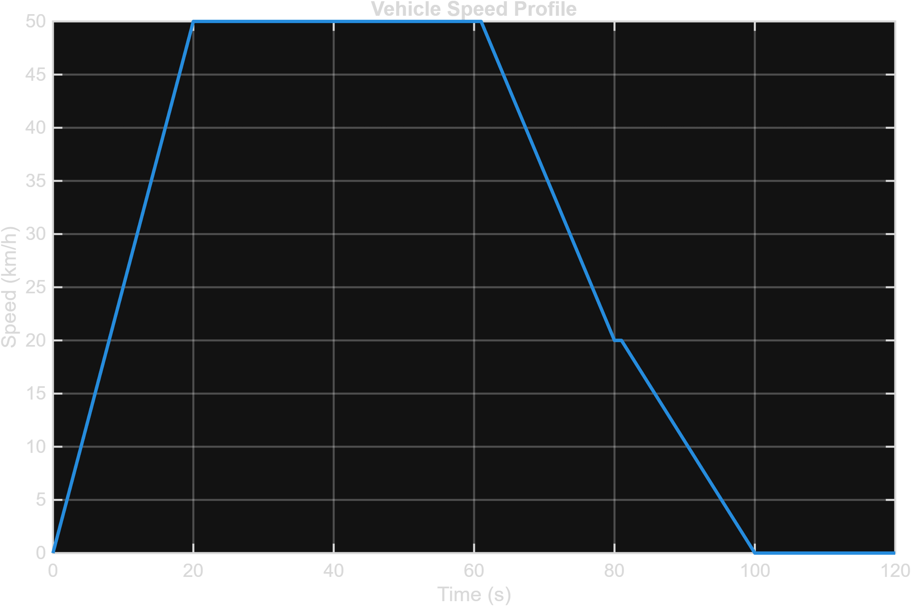
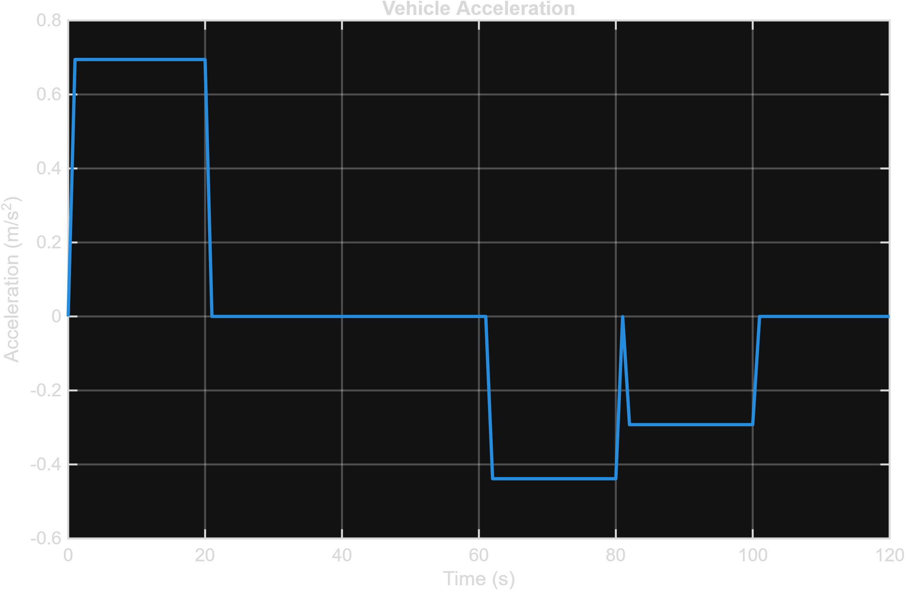
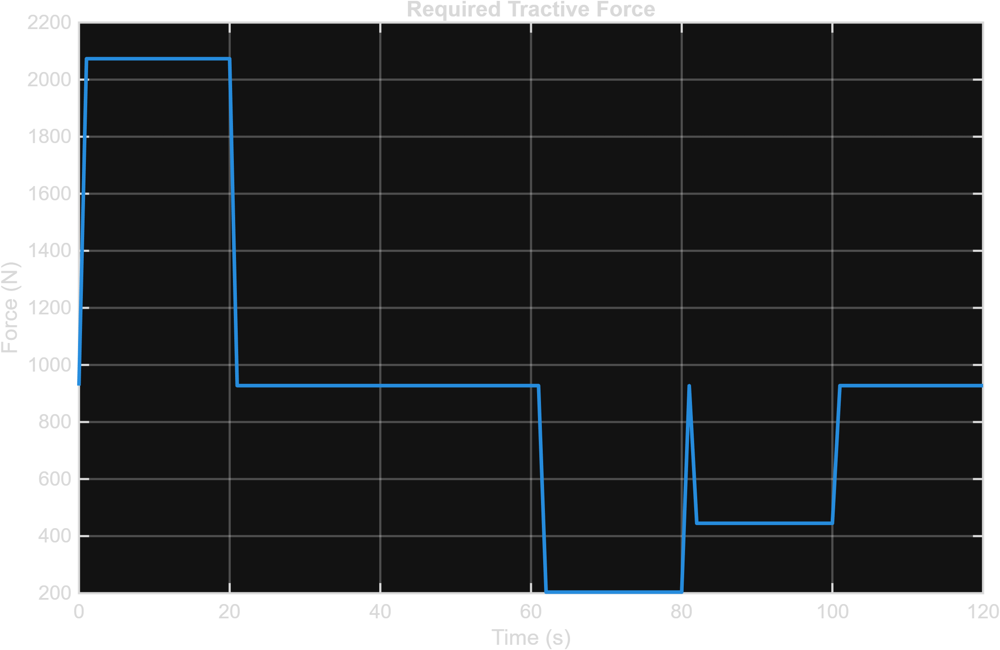
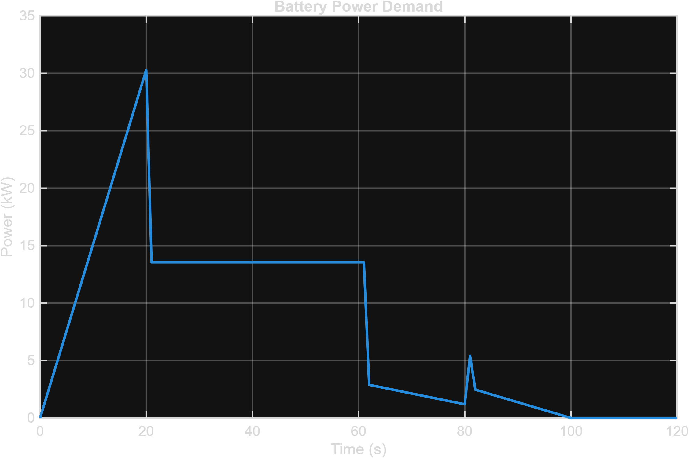
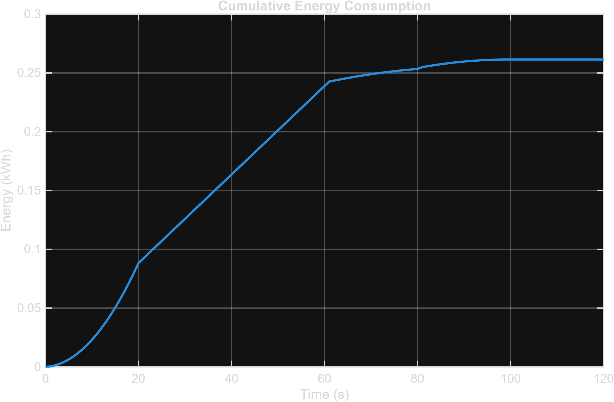

# 🛣️ Drive Cycle Model

## 1. Overview

The drive cycle provides the desired vehicle speed as a function of time — the reference signal the whole closed loop is built around. It's fed to the [Driver Controller](Controller.md), which compares desired speed against actual speed and generates throttle and brake commands to close the gap, and it drives every downstream power and energy calculation in the project.

The drive-cycle calculations are implemented in `Scripts/Drive_Cycle.m`, which is used to analyse:

- Vehicle speed and acceleration
- Tractive force
- Battery power demand
- Cumulative energy consumption
- Overall powertrain response

> **Note on the profile:** `Project_Parameters.m` labels the drive cycle `"FTP75"`, but the actual profile generated in `Drive_Cycle.m` is a short, hand-built **synthetic urban trip** (accelerate, cruise, decelerate, stop) rather than the full EPA FTP-75 test — which itself runs for 1,874 seconds across multiple phases. The synthetic profile is a reasonable stand-in for exercising the powertrain end-to-end, but it shouldn't be read as literally reproducing the certified FTP-75 cycle. Swapping in the real FTP-75 (or WLTP/NEDC) speed trace from `DriveCycles/` would be a natural next step.

---

## 2. Profile Construction

The cycle spans 121 seconds and is built from four straight-line speed segments:

```matlab
EV.DriveCycle.Time = (0:1:120)';

EV.DriveCycle.Speedkmh = zeros(size(EV.DriveCycle.Time));
EV.DriveCycle.Speedkmh(1:21)   = linspace(0, 50, 21);    % 0 -> 20s: accelerate 0 -> 50 km/h
EV.DriveCycle.Speedkmh(22:61)  = 50;                      % 21 -> 60s: cruise at 50 km/h
EV.DriveCycle.Speedkmh(62:81)  = linspace(50, 20, 20);    % 61 -> 80s: decelerate 50 -> 20 km/h
EV.DriveCycle.Speedkmh(82:101) = linspace(20, 0, 20);     % 81 -> 100s: decelerate 20 -> 0 km/h
EV.DriveCycle.Speedkmh(102:end) = 0;                       % 101 -> 120s: stopped
```

This gives a simple accelerate → cruise → two-stage decelerate → stop shape, representative of a single urban trip segment (e.g. leaving a junction, holding speed, and braking to a stop at the next one).



---

## 3. From Speed Profile to Power Demand

The script converts the raw speed trace into acceleration, then chains it forward through the same [Vehicle](Vehicle.md) → [Transmission](Transmission.md) → [Inverter](Inverter.md) → Battery power path used everywhere else in the project — just evaluated at every time step instead of a single design point.

### 3.1 Acceleration and Distance

```matlab
EV.DriveCycle.Speed = EV.DriveCycle.Speedkmh / 3.6;
EV.DriveCycle.Acceleration = [0; diff(EV.DriveCycle.Speed)];
EV.DriveCycle.Distancem = cumsum(EV.DriveCycle.Speed);
```



### 3.2 Tractive Force and Wheel Power

$$
F_{tractive} = m \cdot a + F_{roll} + F_{drag}
$$

```matlab
EV.DriveCycle.Calculated.TractiveForceN = ...
    EV.Vehicle.Mass .* EV.DriveCycle.Acceleration + ...
    EV.Calculated.RollingResistanceForce + ...
    EV.Calculated.AerodynamicDragForce;

EV.DriveCycle.Calculated.WheelPowerkW = ...
    (EV.DriveCycle.Calculated.TractiveForceN .* EV.DriveCycle.Speed) / 1000;
```



### 3.3 Motor Power and Battery Power

Wheel power is stepped back up through the transmission and inverter efficiencies to find what the battery actually has to deliver:

```matlab
EV.DriveCycle.Calculated.MotorPowerkW = ...
    EV.DriveCycle.Calculated.WheelPowerkW / EV.Transmission.Efficiency;

EV.DriveCycle.Calculated.BatteryPowerkW = ...
    EV.DriveCycle.Calculated.MotorPowerkW / EV.Inverter.Efficiency;
```



### 3.4 Cumulative Energy Consumption

```matlab
EnergyPerSecond = EV.DriveCycle.Calculated.BatteryPowerkW / 3600;
EV.DriveCycle.Calculated.EnergykWh = cumsum(EnergyPerSecond);
```



---

## 4. Trip Statistics

```matlab
EV.DriveCycle.Calculated.Distancekm = sum(EV.DriveCycle.Speedkmh .* TimeStep / 3600);
EV.DriveCycle.Calculated.AverageSpeedkmh = mean(EV.DriveCycle.Speedkmh);
EV.DriveCycle.Calculated.MaximumSpeedkmh = max(EV.DriveCycle.Speedkmh);
EV.DriveCycle.Calculated.EnergyConsumptionkWhPerkm = ...
    EV.DriveCycle.Calculated.EnergykWh(end) / EV.DriveCycle.Calculated.Distancekm;
```

Actual output from `Data/Drive_Cycle.mat` for this 120-second trip:

| Result | Value |
|---|---:|
| Simulation Time | 120 s |
| Average Speed | 28.31 km/h |
| Maximum Speed | 50.00 km/h |
| Distance Travelled | 0.951 km |
| Energy Consumed | 0.2614 kWh |
| Energy Consumption | 0.2748 kWh/km |
| Peak Wheel Power | 28.80 kW |
| Peak Motor Power | 29.69 kW |
| Peak Battery Power | 30.29 kW |
| Validation | PASS |

A consumption rate of **0.275 kWh/km** (≈ 275 Wh/km) is in a realistic range for a compact electric SUV, and scales to roughly **166 km** of range from the 45.6 kWh pack at this driving style — before accounting for the energy recovered through [Regenerative Braking](Regenerative_Braking.md).

---

## Related Documentation

| ← Previous | Index | Next → |
|---|---|---|
| [Vehicle](Vehicle.md) | [Documentation Home](../README.md) | [Regenerative Braking](Regenerative_Braking.md) |
