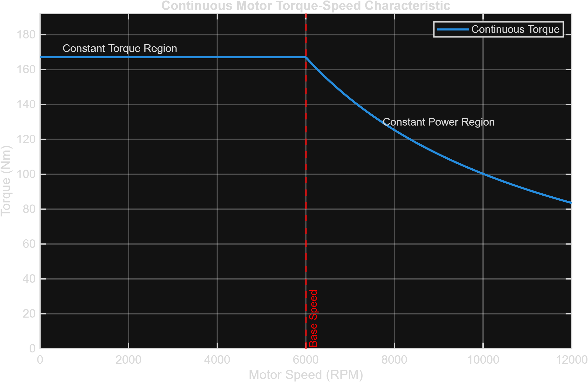
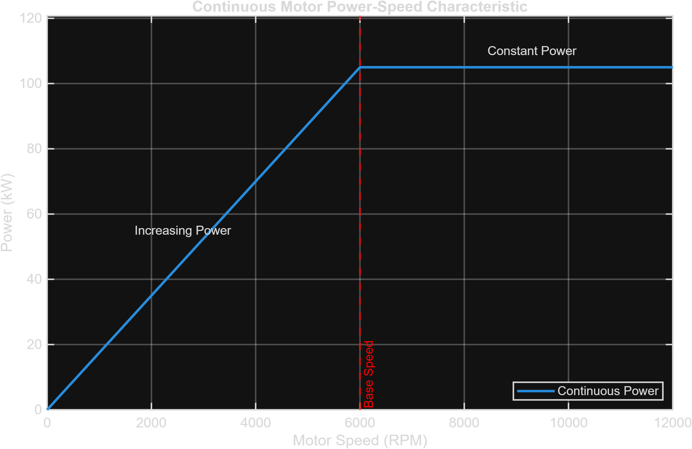

# 🌀 PMSM Motor Model

## 1. Overview

The Smart EV Powertrain Simulator uses a Permanent Magnet Synchronous Motor (PMSM) as the traction motor — the standard choice for modern EVs thanks to its high power density and efficiency. The motor is sized from the vehicle's own performance requirements (top speed, acceleration target) rather than picked arbitrarily, and is characterised using the classic **constant-torque / constant-power** curve shape shared by essentially every traction motor on the road today.

Two MATLAB scripts are associated with the motor design:

| Script | Role |
|---|---|
| `Motor.m` | Calculates the required motor and transmission parameters from vehicle-level force requirements |
| `Motor_Characteristics.m` | Generates the continuous Torque-Speed and Power-Speed curves and saves the resulting plots |

---

## 2. Motor Specifications

The project motor parameters are defined in `Project_Parameters.m`.

| Parameter | Value |
|---|---:|
| Motor Type | PMSM |
| Rated Power | 105 kW |
| Peak Power | 160 kW |
| Base Speed | 6,000 RPM |
| Maximum Speed | 12,000 RPM |
| Maximum Efficiency | 96% |
| Peak Torque | 196.62 Nm *(calculated — see §3.3)* |
| Rated Torque | 167.11 Nm *(calculated — see §3.4)* |

The motor is coupled to the vehicle through a single-speed [transmission](Transmission.md).

---

## 3. Motor Design Calculation

`Motor.m` starts from the vehicle's tractive-force requirements (loaded from `Data/Vehicle_Calculations.mat`) and works backward to a motor and gear ratio that can deliver them.

### 3.1 Wheel Circumference and Speed

```matlab
EV.Calculated.WheelCircumference = 2 * pi * EV.Vehicle.WheelRadius;

EV.Calculated.WheelSpeedRPS = EV.Requirements.TopSpeed / EV.Calculated.WheelCircumference;
EV.Calculated.WheelSpeedRPM = EV.Calculated.WheelSpeedRPS * 60;
```

With a 0.34 m wheel radius and a 41.67 m/s (150 km/h) top speed, this gives a wheel circumference of **2.136 m** and a wheel speed of **1,170.26 RPM** at top speed.

### 3.2 Gear Ratio

The gear ratio is simply the ratio between the motor's maximum speed and the wheel speed needed at top speed:

$$
GR = \frac{RPM_{motor,max}}{RPM_{wheel}}
$$

```matlab
EV.Transmission.GearRatio = EV.Motor.MaximumSpeedRPM / EV.Calculated.WheelSpeedRPM;
```

12,000 / 1,170.26 = **10.254 : 1** — matching the 10.25:1 gear ratio configured in `Project_Parameters.m` to three significant figures. That's not a coincidence: the parameter file's fixed value was originally derived from this same calculation on an earlier design pass and then hard-coded, a common pattern when a script's calculated output becomes the next module's fixed input (see [Transmission](Transmission.md)).

### 3.3 Peak Motor Torque

Working back through the transmission, the wheel torque needed for the vehicle's peak tractive force determines the motor's required peak torque:

```matlab
EV.Calculated.WheelTorqueNm = EV.Calculated.TotalTractiveForce * EV.Vehicle.WheelRadius;

EV.Motor.PeakTorque = EV.Calculated.WheelTorqueNm / ...
    (EV.Transmission.GearRatio * EV.Transmission.Efficiency);
```

5,752.05 N × 0.34 m = 1,955.70 Nm at the wheel, divided by (10.25 × 0.97) at the transmission gives a required peak motor torque of **196.62 Nm** — again matching the configured `Project_Parameters.m` value almost exactly.

### 3.4 Rated Motor Torque

Rated torque is derived directly from rated power and base speed, since by definition the motor produces its rated power at base speed:

$$
T_{rated} = \frac{P_{rated}}{\omega_{base}} \qquad \omega_{base} = \frac{2\pi \cdot RPM_{base}}{60}
$$

```matlab
BaseSpeedRadPerSec = (2 * pi * EV.Motor.BaseSpeedRPM) / 60;
EV.Motor.RatedTorque = EV.Motor.RatedPower / BaseSpeedRadPerSec;
```

105,000 W ÷ 628.32 rad/s = **167.11 Nm** rated torque.

---

## 4. Motor Characteristics — Torque-Speed and Power-Speed Curves

`Motor_Characteristics.m` sweeps 500 points from 0 to the maximum motor speed and builds the two curves every PMSM traction motor is specified by:

```matlab
for k = 1:length(MotorSpeedRPM)
    if MotorSpeedRPM(k) <= EV.Motor.BaseSpeedRPM
        % Constant Torque Region
        MotorTorqueNm(k) = EV.Motor.RatedTorque;
    else
        % Constant Power Region
        MotorTorqueNm(k) = EV.Motor.RatedPower / MotorSpeedRadPerSec(k);
    end
end

MotorPowerW = MotorTorqueNm .* MotorSpeedRadPerSec;
```

- **Below base speed (0 – 6,000 RPM):** torque is held at its rated value while power ramps up linearly with speed — the *constant torque region*.
- **Above base speed (6,000 – 12,000 RPM):** power is held constant at the rated value while torque falls off as 1/speed — the *constant power (field-weakening) region*.





---

## 5. Simulink Runtime Model

Inside `Models/Smart_EV_Powertrain.slx`, the `PMSM Motor` subsystem turns the demanded power into torque and then enforces the motor's operating envelope in real time, using two MATLAB Function blocks.

**Power to Torque** — a straightforward τ = P/ω conversion, with a floor on speed to avoid dividing by (near) zero at standstill:

```matlab
function torque = fcn(power, rpm)

% Prevent division by zero
rpm_safe = max(abs(rpm), 100);

% Convert RPM to rad/s
omega = rpm_safe * 2*pi/60;

% Calculate torque
torque = power / omega;
```

**Torque-Speed Limit** — clamps the requested torque to what the motor can actually deliver at the current speed, and blends in regenerative braking torque when the driver brakes:

```matlab
function [torque_out, motor_power] = fcn(torque, rpm, brake)

PeakTorque      = 180;      % Nm
RatedTorque     = 140;      % Nm
BaseRPM         = 3000;     % Constant torque region
MaxRPM          = 6000;     % Maximum motor speed
MaxRegenTorque  = 120;      % Maximum regenerative torque
MinRegenRPM     = 200;      % Regen fades below this speed

if rpm <= BaseRPM
    MaxAllowedTorque = PeakTorque;
elseif rpm < MaxRPM
    MaxAllowedTorque = RatedTorque * BaseRPM / rpm;   % Constant power region
else
    MaxAllowedTorque = 0;
end

DriveTorque = min(max(torque, 0), MaxAllowedTorque);

if brake > 0
    RegenFactor = (rpm >= MinRegenRPM) * 1 + (rpm < MinRegenRPM) * (rpm / MinRegenRPM);
    RegenTorque = brake * MaxRegenTorque * RegenFactor;
else
    RegenTorque = 0;
end

torque_out = DriveTorque - RegenTorque;
torque_out = max(min(torque_out, PeakTorque), -MaxRegenTorque);

omega = rpm * 2*pi/60;
motor_power = torque_out * omega;
```

*(The `if/elseif` regen-factor logic has been condensed above for readability; the model itself uses an explicit if/else.)*

> **Note:** This block runs on its own locally-defined limits — 180 Nm peak, 140 Nm rated, a 3,000 RPM base speed and a 6,000 RPM ceiling — which are noticeably more conservative than the 196.62 Nm / 167.11 Nm / 6,000 RPM / 12,000 RPM figures the sizing calculation in §3 derives. The dynamic simulation and the static sizing script were tuned somewhat independently; aligning the runtime envelope to the calculated design values is a natural next step (see [Future Scope](../README.md#-future-scope)).

---

## Related Documentation

| ← Previous | Index | Next → |
|---|---|---|
| [Inverter](Inverter.md) | [Documentation Home](../README.md) | [Transmission](Transmission.md) |
