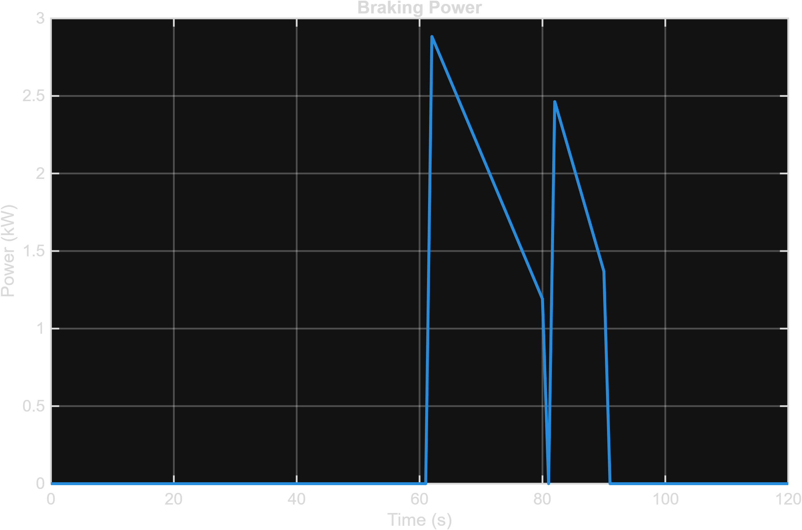
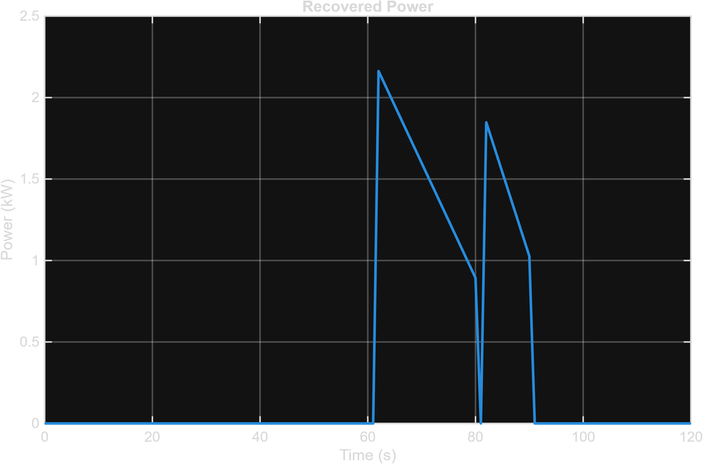
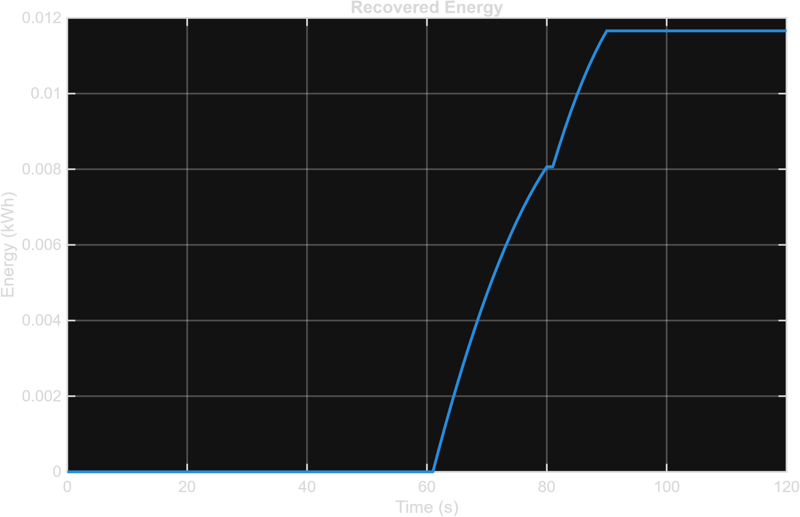
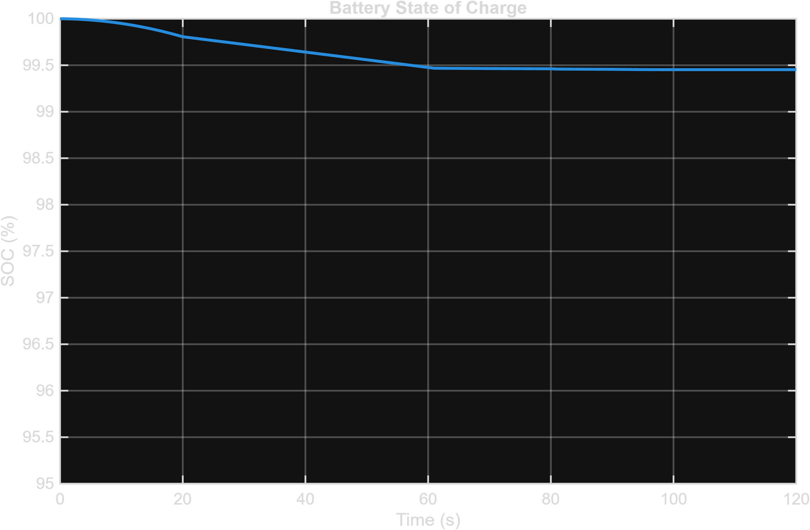

# ♻️ Regenerative Braking System

## 1. Overview

The regenerative braking model recovers electrical energy during vehicle deceleration instead of dissipating it entirely as heat through friction brakes — one of the defining efficiency advantages of an EV powertrain over a conventional one.

The logic is implemented in `Scripts/Regenerative_Braking.m`, which post-processes the completed [Drive Cycle](Drive_Cycle.md) simulation: wherever the vehicle was decelerating, it works out how much of that braking power could realistically have been captured and fed back into the [Battery](Battery.md).

---

## 2. Regenerative Braking Specifications

| Parameter | Value |
|---|---:|
| Regenerative Efficiency | 75% |
| Maximum Regenerative Power | 80 kW |
| Minimum Regenerative Speed | 10 km/h |

The minimum-speed cutoff reflects a real limitation of regenerative braking: at very low speeds the motor isn't spinning fast enough to generate meaningful back-EMF, so friction brakes have to take over to bring the vehicle fully to a stop.

---

## 3. Regenerative Braking Method

### 3.1 Braking Detection

Regeneration is only considered active when the vehicle is decelerating *and* still above the minimum cutoff speed:

```matlab
EV.Regeneration.Calculated.IsBraking = EV.DriveCycle.Acceleration < 0;

EV.Regeneration.Calculated.IsRegenerationActive = ...
    EV.Regeneration.Calculated.IsBraking & ...
    (EV.DriveCycle.Speedkmh >= EV.Regeneration.MinSpeedkmh);
```

### 3.2 Available Braking Power

During active regeneration windows, the available braking power is taken directly from the magnitude of the battery power the drive cycle would otherwise show as negative (i.e. the power the powertrain is shedding while slowing down):

```matlab
EV.Regeneration.Calculated.BrakingPowerkW = zeros(size(EV.DriveCycle.Time));

EV.Regeneration.Calculated.BrakingPowerkW(EV.Regeneration.Calculated.IsRegenerationActive) = ...
    abs(EV.DriveCycle.Calculated.BatteryPowerkW(EV.Regeneration.Calculated.IsRegenerationActive));
```



### 3.3 Recovered Power

Only a fraction of the available braking power is actually recoverable, set by the regeneration efficiency, and further capped by the maximum regenerative power the inverter/battery can accept:

```matlab
EV.Regeneration.Calculated.RecoveredPowerkW = ...
    EV.Regeneration.Calculated.BrakingPowerkW .* EV.Regeneration.Efficiency;

EV.Regeneration.Calculated.RecoveredPowerkW = ...
    min(EV.Regeneration.Calculated.RecoveredPowerkW, EV.Regeneration.MaxPowerkW);
```



### 3.4 Recovered and Net Battery Energy

```matlab
RecoveredEnergyPerSecond = EV.Regeneration.Calculated.RecoveredPowerkW / 3600;
EV.Regeneration.Calculated.RecoveredEnergykWh = cumsum(RecoveredEnergyPerSecond);

EV.Regeneration.Calculated.NetBatteryEnergykWh = ...
    EV.DriveCycle.Calculated.EnergykWh - EV.Regeneration.Calculated.RecoveredEnergykWh;
```



### 3.5 Recovery Percentage and State of Charge

```matlab
EV.Regeneration.Calculated.RecoveryPercent = ...
    EV.Regeneration.Calculated.TotalRecoveredEnergykWh / TotalConsumedEnergy * 100;

BatteryCapacitykWh = EV.Battery.Calculated.Energy.kWh;
InitialSOC = 100;

EnergyUsedPercent = EV.Regeneration.Calculated.NetBatteryEnergykWh ./ BatteryCapacitykWh * 100;
EV.Regeneration.Calculated.StateOfChargePercent = InitialSOC - EnergyUsedPercent;
```



### 3.6 Validation

```matlab
ValidationStatus = "PASS";
if EV.Regeneration.Calculated.RecoveryPercent > 100
    ValidationStatus = "FAIL";
end
if any(EV.Regeneration.Calculated.StateOfChargePercent > 100)
    ValidationStatus = "FAIL";
end
```

---

## 4. Results at a Glance

Actual output from `Data/Regenerative_Braking.mat`, for the same 120-second drive cycle used in [Drive Cycle](Drive_Cycle.md):

| Result | Value |
|---|---:|
| Recovered Energy | 0.0117 kWh |
| Energy Consumed (before regen) | 0.2614 kWh |
| Recovery Percentage | 4.46% |
| Net Battery Energy Used | 0.2498 kWh |
| Final State of Charge | 99.45% |
| Validation | PASS |

Recovering **4.46%** of consumed energy on a short, mostly-cruising trip is a realistic figure — regenerative braking contributes more on stop-and-go city driving with frequent, harder decelerations than it does on a profile dominated by a steady 50 km/h cruise, which is exactly the shape of this drive cycle.

---

## Related Documentation

| ← Previous | Index | Next → |
|---|---|---|
| [Drive Cycle](Drive_Cycle.md) | [Documentation Home](../README.md) | [Controller](Controller.md) |
