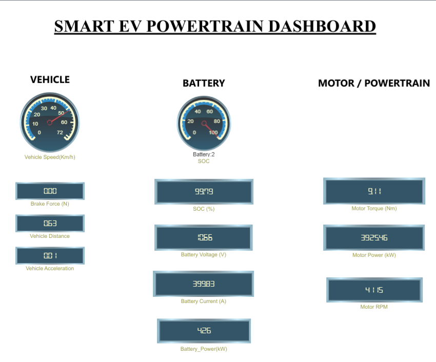
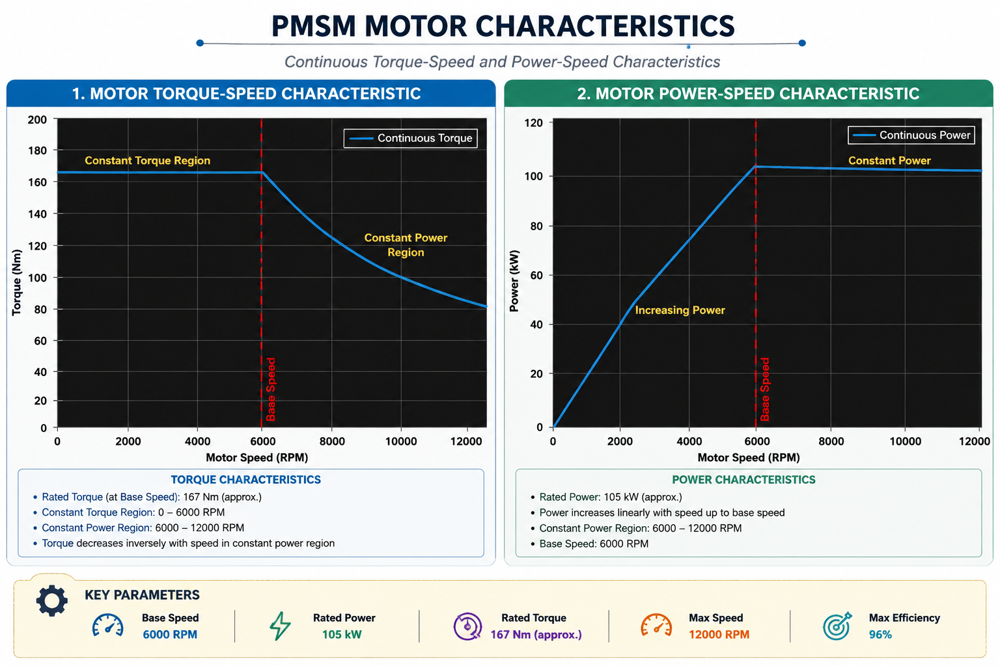

# ⚡ Smart EV Powertrain Simulator

### A MATLAB/Simulink-based closed-loop electric vehicle powertrain simulation platform for modelling vehicle dynamics, battery behaviour, PMSM motor performance, power flow, regenerative braking, and intelligent speed control.

<p align="center">


</p>

---

## 🚗 Project Preview

<p align="center">

<!-- Add your dashboard screenshot here -->
<!-- Save the screenshot as Images/Dashboard.png -->



</p>

> **Smart EV Powertrain Simulator** integrates the major electrical, mechanical, and control subsystems of an electric vehicle into a single closed-loop MATLAB/Simulink simulation environment.

---

## 📌 About the Project

The **Smart EV Powertrain Simulator** is an engineering simulation project developed using **MATLAB and Simulink** to model the behaviour of a complete electric vehicle powertrain.

The simulator starts with a reference **drive cycle**, compares the desired vehicle speed with the actual vehicle speed, and uses a **closed-loop driver controller** to generate throttle and braking commands.

The commands are then processed through the EV powertrain:

```text
Drive Cycle
     │
     ▼
Driver Controller
     │
     ├──────────────► Brake
     │
     ▼
   Battery
     │
     ▼
  Inverter
     │
     ▼
 PMSM Motor
     │
     ▼
Transmission
     │
     ▼
Vehicle Dynamics
     │
     ▼
Vehicle Speed
     │
     └──────────── Feedback ────────────► Driver Controller
```

The project also includes a dedicated **EV Powertrain Dashboard** for monitoring important vehicle and powertrain parameters during simulation.

---

## 🎯 Project Objectives

The main objectives of this project are:

- Model a complete EV powertrain using MATLAB/Simulink
- Develop a closed-loop vehicle speed controller
- Model battery power, voltage, current, and SOC
- Model inverter power conversion
- Model PMSM traction motor behaviour
- Implement single-speed transmission
- Model longitudinal vehicle dynamics
- Implement regenerative braking
- Analyse vehicle speed and acceleration
- Monitor powertrain parameters using a dashboard
- Perform engineering calculations using MATLAB scripts
- Organize simulation results and technical documentation

---

## ✨ Key Features

### 🔋 Battery System

- LFP battery cell model
- Battery pack sizing
- Series/parallel cell calculation
- Battery voltage calculation
- Battery current calculation
- Battery power calculation
- SOC estimation
- Charge/discharge efficiency

### ⚡ Inverter

- DC-side battery power input
- Motor-side power output
- Two-level inverter representation
- Configurable inverter efficiency
- Configurable modulation index

### 🌀 PMSM Motor

- PMSM traction motor model
- Power-to-torque conversion
- Torque-speed limitation
- Constant torque region
- Constant power region
- Motor RPM calculation
- Motor torque monitoring
- Motor power monitoring

### ⚙️ Transmission

- Single-speed transmission
- Gear reduction
- Torque multiplication
- Wheel torque calculation
- Vehicle-speed-to-motor-speed conversion

### 🚘 Vehicle Dynamics

- Rolling resistance
- Aerodynamic drag
- Tractive force
- Braking force
- Road grade
- Vehicle acceleration
- Vehicle speed
- Vehicle distance

### 🎮 Closed-Loop Controller

- Desired-speed input
- Actual-speed feedback
- Speed error calculation
- PID controller
- Throttle logic
- Brake logic
- Throttle limiting
- Brake command generation

### ♻️ Regenerative Braking

- Regenerative braking logic
- Regenerative efficiency
- Maximum regenerative power
- Minimum regenerative operating speed
- Battery charging representation

### 📊 Dashboard

The project includes a dedicated Simulink dashboard displaying:

**Vehicle**

- Vehicle Speed
- Brake Force
- Vehicle Distance
- Vehicle Acceleration

**Battery**

- SOC
- Battery Voltage
- Battery Current
- Battery Power

**Motor / Powertrain**

- Motor Torque
- Motor Power
- Motor RPM

---

## 🛠️ Tech Stack

| Technology | Purpose |
|---|---|
| MATLAB | Engineering calculations and parameter processing |
| Simulink | Dynamic EV powertrain modelling |
| MATLAB Functions | Component-level mathematical models |
| MATLAB Project | Project and path management |
| Git | Version control |
| GitHub | Repository hosting |
| Markdown | Technical documentation |

---

## 📐 Reference Vehicle

The simulator uses **SEV-01**, a compact electric SUV configuration, as the reference vehicle.

| Parameter | Value |
|---|---:|
| Vehicle Type | Compact Electric SUV |
| Vehicle Mass | 1650 kg |
| Drive Configuration | Front Wheel Drive |
| Top Speed | 150 km/h |
| 0–100 km/h Target | 9.5 s |
| Passenger Capacity | 5 |
| Drag Coefficient | 0.30 |
| Frontal Area | 2.40 m² |
| Rolling Resistance Coefficient | 0.010 |
| Wheel Radius | 0.34 m |

---

## 🔋 Battery Configuration

The reference battery system uses an **LFP 32700 cylindrical cell** model.

| Parameter | Value |
|---|---:|
| Chemistry | Lithium Iron Phosphate (LFP) |
| Cell Type | 32700 Cylindrical |
| Nominal Cell Voltage | 3.2 V |
| Maximum Cell Voltage | 3.65 V |
| Minimum Cell Voltage | 2.50 V |
| Cell Capacity | 6 Ah |
| Continuous Current | 18 A |
| Peak Current | 30 A |
| Internal Resistance | 0.006 Ω |
| Cell Mass | 0.145 kg |

### Battery Pack Target

| Parameter | Value |
|---|---:|
| Target Pack Voltage | 400 V |
| Target Pack Energy | 45 kWh |
| Initial SOC | 100 % |
| Maximum SOC | 100 % |
| Minimum SOC | 0 % |
| Maximum Battery Power | 50 kW |
| Discharge Efficiency | 95 % |
| Charge Efficiency | 90 % |

---

## 🌀 Motor Configuration

The traction motor is represented using a **Permanent Magnet Synchronous Motor (PMSM)** model.

| Parameter | Value |
|---|---:|
| Motor Type | PMSM |
| Rated Power | 105 kW |
| Peak Power | 160 kW |
| Base Speed | 6000 RPM |
| Maximum Speed | 12000 RPM |
| Maximum Efficiency | 96 % |

The implemented motor characteristic contains two main operating regions:

```text
              Motor Torque
                   │
                   │─────────────── Constant Torque
                   │               Region
                   │
                   │              ╲
                   │               ╲
                   │                ╲ Constant Power
                   │                 ╲ Region
                   │
                   └──────────────────────── Motor Speed
                                  Base Speed
```

---

## ⚡ Inverter Configuration

| Parameter | Value |
|---|---:|
| Type | Three-Phase Voltage Source Inverter |
| Topology | Two-Level |
| Switching Frequency | 10 kHz |
| Efficiency | 98 % |
| Modulation Index | 0.95 |

---

## ⚙️ Transmission Configuration

| Parameter | Value |
|---|---:|
| Type | Single Speed |
| Gear Ratio | 10.25 : 1 |
| Efficiency | 97 % |

---

## ♻️ Regenerative Braking Configuration

| Parameter | Value |
|---|---:|
| Regenerative Efficiency | 75 % |
| Maximum Regenerative Power | 80 kW |
| Minimum Regenerative Speed | 10 km/h |

---

## 📂 Project Structure

```text
Smart-EV-Powertrain-Simulator/
│
├── Battery/
├── Controllers/
├── Data/
│
├── Documentation/
│   ├── Architecture/
│   ├── Battery.md
│   ├── Controller.md
│   ├── Design_Decisions.md
│   ├── Drive_Cycle.md
│   ├── Installation_Guide.md
│   ├── Inverter.md
│   ├── Motor.md
│   ├── Project_Log.md
│   ├── Regenerative_Braking.md
│   ├── Transmission.md
│   ├── User_Manual.md
│   └── Vehicle.md
│
├── DriveCycles/
├── Images/
├── MATLAB/
│
├── Models/
│   ├── Smart_EV_Powertrain.slx
│   └── Smart_EV_Powertrain_Dashboard.slx
│
├── Motor/
├── Reports/
├── Results/
│
├── Scripts/
│   ├── Battery.m
│   ├── Drive_Cycle.m
│   ├── Initialize_Project.m
│   ├── Inverter.m
│   ├── Motor.m
│   ├── Motor_Characteristics.m
│   ├── Performance_Summary.m
│   ├── Project_Parameters.m
│   ├── Regenerative_Braking.m
│   ├── Transmission.m
│   ├── Vehicle.m
│   └── Vehicle_Dynamics.m
│
├── Tests/
├── Vehicle/
│
├── .gitignore
├── Coding_Standard.md
├── README.md
├── Run_Project.m
└── Smart-EV-Powertrain-Simulator.prj
```

---

# 🚀 Installation

## Prerequisites

Make sure the following are installed:

- MATLAB
- Simulink
- Git

A MATLAB installation capable of opening the included `.slx` models is required.

---

## Clone the Repository

Open a terminal or Command Prompt:

```bash
git clone https://github.com/devsurya2004/Smart-EV-Powertrain-Simulator.git
```

Navigate into the project:

```bash
cd Smart-EV-Powertrain-Simulator
```

---

## Open the MATLAB Project

Open:

```text
Smart-EV-Powertrain-Simulator.prj
```

The MATLAB project file is recommended because it manages the project environment and paths.

---

# ▶️ Usage

## 1. Open the Project

Open:

```text
Smart-EV-Powertrain-Simulator.prj
```

in MATLAB.

---

## 2. Run the Engineering Calculations

The calculation scripts are located in:

```text
Scripts/
```

These scripts perform calculations for:

```text
Vehicle
Battery
Motor
Motor Characteristics
Transmission
Inverter
Regenerative Braking
Drive Cycle
Performance Summary
```

---

## 3. Open the Main Simulink Model

Open:

```text
Models/Smart_EV_Powertrain.slx
```

The main model integrates:

```text
Drive Cycle
      ↓
Driver Controller
      ↓
Battery
      ↓
Inverter
      ↓
PMSM Motor
      ↓
Transmission
      ↓
Vehicle Dynamics
      ↓
Vehicle Speed
      └──────────────► Feedback
```

Run the simulation using the Simulink **Run** button.

---

## 4. Open the Dashboard

Open:

```text
Models/Smart_EV_Powertrain_Dashboard.slx
```

The dashboard provides a high-level view of the simulated EV.

---

# 📊 Simulation Outputs

The simulator provides information about:

### Vehicle

- Desired speed
- Actual speed
- Vehicle acceleration
- Vehicle distance
- Brake force

### Battery

- Battery SOC
- Battery voltage
- Battery current
- Battery power

### Motor

- Motor torque
- Motor power
- Motor RPM

### Powertrain

- Power flow
- Transmission output torque
- Vehicle tractive force
- Regenerative braking behaviour

---

# 📈 Results

Simulation and engineering results are organized inside:

```text
Results/
```

Current result categories include:

```text
Results/
├── Battery/
├── DriveCycle/
├── Inverter/
├── Motor/
├── PerformanceSummary/
├── RegenerativeBraking/
├── Simulink/
├── Transmission/
└── VehicleDynamics/
```

Selected plots and simulation outputs can be used to analyse the behaviour of the complete EV powertrain.

---

# 📚 Documentation

Detailed technical documentation is available in:

```text
Documentation/
```

| Document | Description |
|---|---|
| [Battery](Documentation/Battery.md) | Battery modelling and calculations |
| [Controller](Documentation/Controller.md) | Driver controller and PID control |
| [Design Decisions](Documentation/Design_Decisions.md) | Major engineering decisions |
| [Drive Cycle](Documentation/Drive_Cycle.md) | Drive-cycle implementation |
| [Installation Guide](Documentation/Installation_Guide.md) | Detailed installation procedure |
| [Inverter](Documentation/Inverter.md) | Inverter implementation |
| [Motor](Documentation/Motor.md) | PMSM motor model |
| [Regenerative Braking](Documentation/Regenerative_Braking.md) | Regenerative braking model |
| [Transmission](Documentation/Transmission.md) | Transmission model |
| [User Manual](Documentation/User_Manual.md) | Detailed project usage |
| [Vehicle](Documentation/Vehicle.md) | Vehicle dynamics model |
| [Project Log](Documentation/Project_Log.md) | Development history |

---

# 🧠 Engineering Architecture

The simulator follows a modular architecture where each major EV component is represented as an independent Simulink subsystem.

```text
                 ┌─────────────────┐
                 │   Drive Cycle   │
                 └────────┬────────┘
                          │
                          ▼
                 ┌─────────────────┐
                 │     Driver      │
                 │    Controller   │
                 └────────┬────────┘
                          │
                          ▼
                 ┌─────────────────┐
                 │     Battery     │
                 └────────┬────────┘
                          │
                          ▼
                 ┌─────────────────┐
                 │    Inverter     │
                 └────────┬────────┘
                          │
                          ▼
                 ┌─────────────────┐
                 │   PMSM Motor    │
                 └────────┬────────┘
                          │
                          ▼
                 ┌─────────────────┐
                 │  Transmission   │
                 └────────┬────────┘
                          │
                          ▼
                 ┌─────────────────┐
                 │ Vehicle Dynamics│
                 └────────┬────────┘
                          │
                          ▼
                 ┌─────────────────┐
                 │ Vehicle Motion  │
                 └────────┬────────┘
                          │
                          └──────► Feedback
```

---

# 🔮 Future Scope

Possible future improvements include:

- Detailed electrochemical battery modelling
- Battery thermal modelling
- Battery State-of-Health estimation
- Cell balancing
- Advanced BMS implementation
- Detailed PMSM dq-axis modelling
- Field-oriented control
- Detailed inverter switching model
- Semiconductor loss modelling
- Motor thermal modelling
- Tire-road interaction
- Advanced energy management
- Predictive control
- Hardware-in-the-loop implementation
- Real-time embedded implementation

---

# 🤝 Contributing

Contributions, suggestions and improvements are welcome.

To contribute:

### 1. Fork the repository

```bash
git clone https://github.com/devsurya2004/Smart-EV-Powertrain-Simulator.git
```

### 2. Create a new branch

```bash
git checkout -b feature/your-feature
```

### 3. Make your changes

Modify the relevant MATLAB, Simulink or documentation files.

### 4. Commit your changes

```bash
git add .
git commit -m "Add your feature"
```

### 5. Push the branch

```bash
git push origin feature/your-feature
```

### 6. Open a Pull Request

Submit a Pull Request describing:

- What was changed
- Why it was changed
- How it was tested
- Any limitations or known issues

---

# 🐛 Issues and Suggestions

If you find a problem or have an improvement suggestion, please open an issue in the GitHub repository.

Useful issue information includes:

- Description of the problem
- MATLAB version
- Simulink version
- Steps to reproduce
- Error messages
- Screenshots where applicable

---

# 📄 License

This project is licensed under the MIT License.

You are free to use, copy, modify, merge, publish, distribute, sublicense, and/or sell copies of the project, subject to the conditions of the license.

See the [LICENSE](LICENSE) file for the complete license text.

# 👨‍💻 Author

**Suryadev P M**

Electrical and Electronics Engineering Student

### Project

**Smart EV Powertrain Simulator**

```text
Project ID : SEV-01
Version    : 1.0
```

---

# ⭐ Project Highlights

```text
MATLAB + Simulink
        │
        ▼
Vehicle Dynamics
        │
        ├── Battery
        ├── Inverter
        ├── PMSM Motor
        ├── Transmission
        ├── Driver Controller
        └── Regenerative Braking
        │
        ▼
Closed-Loop EV Simulation
        │
        ▼
Dashboard Visualization
```

---

<p align="center">

<b>Smart EV Powertrain Simulator</b>

<br>

<i>Modelling the complete EV powertrain from drive cycle to vehicle motion.</i>

</p>

## Tech Stack

The Smart EV Powertrain Simulator is built using engineering and simulation tools commonly used for electric vehicle powertrain development.

| Technology / Tool | Purpose |
|---|---|
| **MATLAB** | Engineering calculations, parameter management, component calculations and result generation |
| **Simulink** | Dynamic modelling and simulation of the complete EV powertrain |
| **MATLAB Project** | Project organization, path management and reproducible project setup |
| **MATLAB Scripts (.m)** | Battery, motor, inverter, transmission, vehicle dynamics and regenerative braking calculations |
| **Simulink Models (.slx)** | Integrated powertrain model, dashboard and subsystem-level simulation |
| **MATLAB Function Blocks** | Custom component behaviour such as battery, inverter, motor and vehicle dynamics |
| **Scopes & Visualization** | Monitoring battery, motor, vehicle and controller variables during simulation |
| **Git** | Version control and project history |
| **GitHub** | Remote repository, project documentation and source-code hosting |

### Core Simulation Technologies

The project combines several modelling approaches:

- **Physics-based calculations** for vehicle forces and power requirements
- **Mathematical models** for battery, inverter, motor and transmission behaviour
- **Dynamic Simulink models** for time-domain simulation
- **Closed-loop control** for vehicle speed tracking
- **Drive-cycle based testing** for evaluating vehicle response
- **Regenerative braking modelling** for energy recovery
- **Data logging and visualization** for analysing simulation results

### Main File Types

```text
.m       → MATLAB calculation and configuration scripts
.slx     → Simulink models
.prj     → MATLAB Project file
.mat     → Stored calculation and simulation results
.png     → Generated plots, diagrams and project visuals
.md      → Project documentation
```
### Installation

Follow the steps below to install and prepare the Smart EV Powertrain Simulator.

### Prerequisites

Before running the project, make sure the following software is installed:

- MATLAB
- Simulink
- Git
- A GitHub account if you want to clone or contribute to the repository

The project is designed to be opened through the MATLAB Project file:

```text
Smart-EV-Powertrain-Simulator.prj
```
## Usage

The Smart EV Powertrain Simulator can be used in two main stages:

1. MATLAB-based engineering calculations
2. Integrated MATLAB/Simulink dynamic simulation

The recommended workflow is:

```text
Open MATLAB Project
        ↓
Initialize Project
        ↓
Load Project Parameters
        ↓
Run Engineering Calculations
        ↓
Open Simulink Model
        ↓
Run Simulation
        ↓
Monitor Results
        ↓
Analyse Performance
```
## Visual Showcase

### EV Powertrain Dashboard

The project includes a dedicated Simulink dashboard for monitoring important vehicle and powertrain variables during simulation.


The dashboard provides visual monitoring of:

- Vehicle speed
- Vehicle acceleration
- Vehicle distance
- Battery SOC
- Battery voltage
- Battery current
- Battery power
- Motor torque
- Motor power
- Motor RPM
- Brake command

### Motor Characteristics

The PMSM traction motor is modelled using continuous torque-speed and power-speed characteristics.



The characteristics demonstrate the two main operating regions:

- **Constant Torque Region:** 0–6000 RPM
- **Constant Power Region:** 6000–12000 RPM

The model uses a base speed of 6000 RPM and a maximum motor speed of 12000 RPM.

### Powertrain Architecture

The complete EV powertrain follows a closed-loop architecture:

```text
Drive Cycle
     │
     ▼
Driver Controller
     │
     ▼
Battery
     │
     ▼
Inverter
     │
     ▼
PMSM Motor
     │
     ▼
Transmission
     │
     ▼
Vehicle Dynamics
     │
     ▼
Vehicle Speed
     │
     └────────────── Feedback ──────────────►
                         Driver Controller
